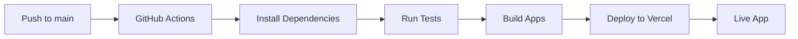

# 🚀 Pipeline de Despliegue

## Configuración del Pipeline

### 1. **GitHub Actions** (CI/CD)
- **Trigger**: Push a `main` y `develop`
- **Node.js**: 22.x
- **Tests**: Automáticos antes del despliegue
- **Build**: Automático para ambos proyectos

### 2. **Vercel** (Hosting)
- **Framework**: Angular 20
- **Node.js**: 22.x
- **Build**: Automático desde GitHub
- **Deploy**: Automático en cada push a `main`

## 🔧 Configuración Requerida

### Secrets de GitHub (Repository Settings > Secrets and variables > Actions):
```
VERCEL_TOKEN=tu_token_de_vercel
ORG_ID=tu_org_id_de_vercel
PROJECT_ID=tu_project_id_de_vercel
```

### Configuración de Vercel:
1. Conectar repositorio a Vercel
2. Configurar variables de entorno
3. Activar auto-deploy

## 📊 Pipeline Flow



## 🌐 URLs de Producción

- **Shell App**: `https://tu-proyecto.vercel.app/`
- **Customers MF**: `https://tu-proyecto.vercel.app/customers/`

## 🔍 Monitoreo

- **Tests**: 57 specs, 54 passing (94.7%)
- **Coverage**: HTML reports generados
- **Build**: Automático en cada commit
- **Deploy**: Automático en push a main
